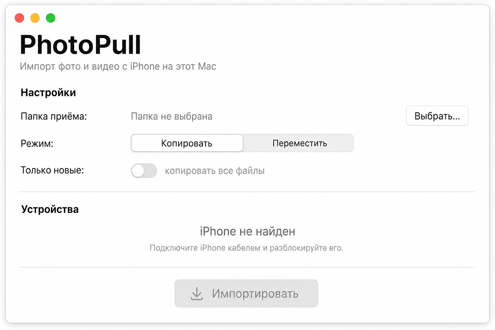
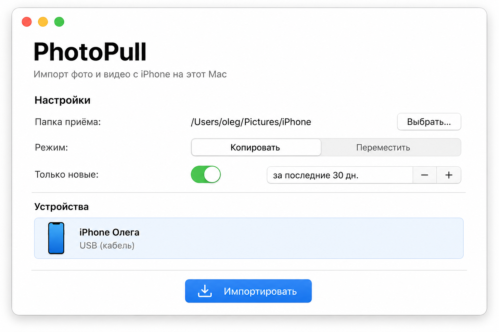
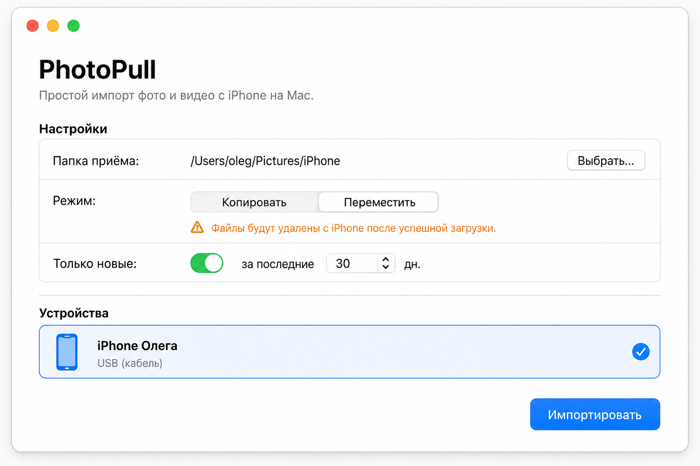
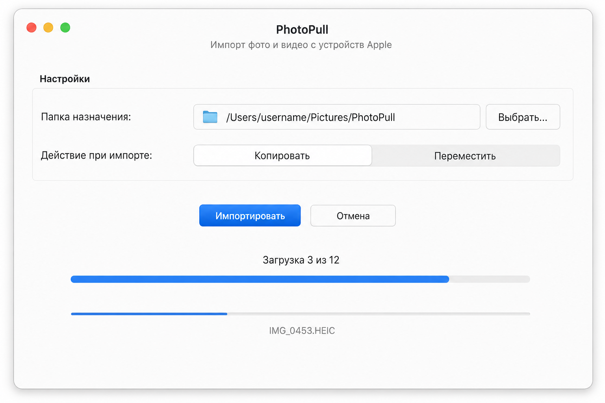
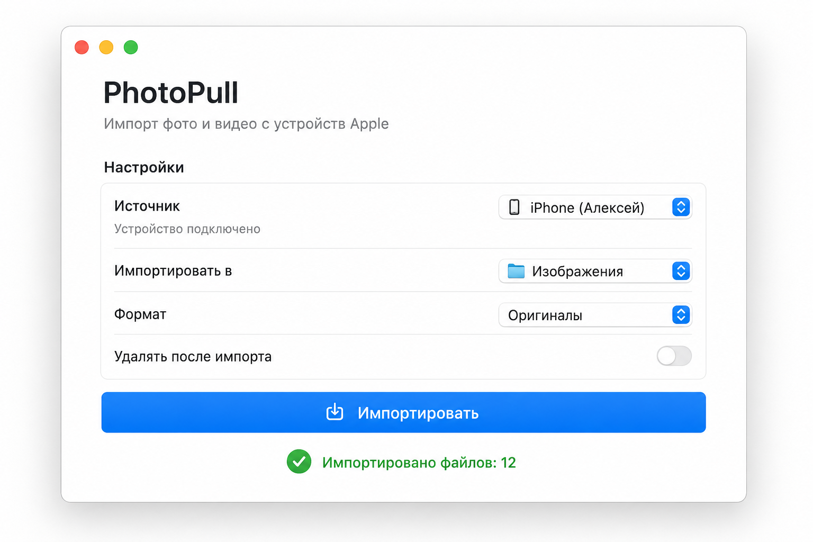
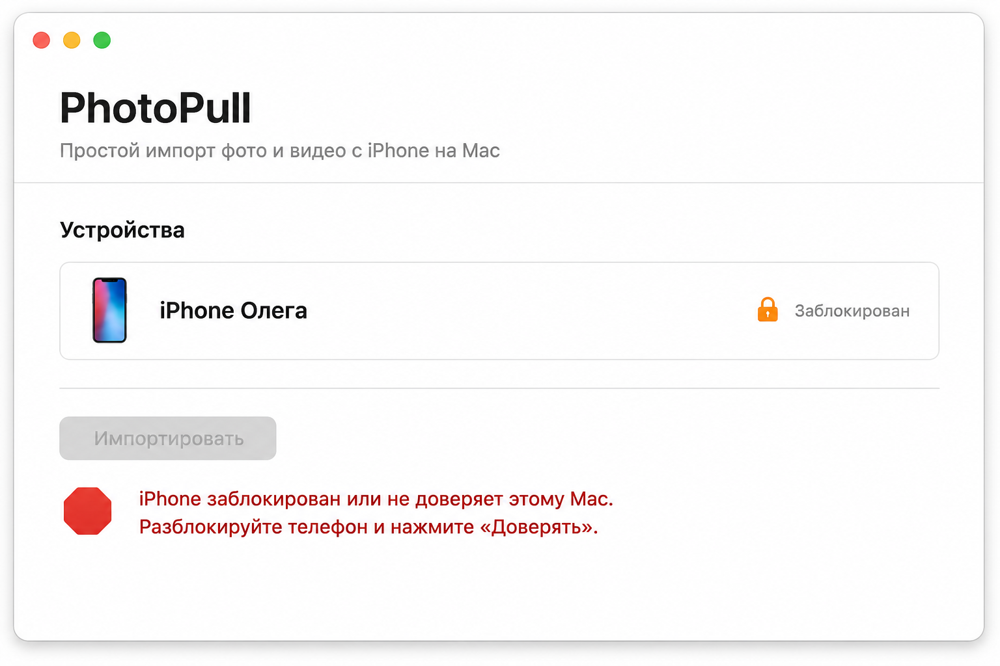

# PhotoPull — инструкция пользователя

**PhotoPull** — простое приложение для macOS: переносит фото и видео с iPhone на Mac
через системный механизм импорта (Image Capture). Приложение на телефоне не нужно.

> ℹ️ **О скриншотах.** Изображения ниже — визуальные макеты интерфейса, отражающие реальные
> экраны приложения (те же секции и подписи). Они сгенерированы, т.к. на текущем этапе сборка
> приложения выполняется в CI/на Mac; на настоящем Mac эти кадры можно заменить реальными
> скриншотами. Возможны незначительные расхождения в формулировках подписей.

---

## Что нужно перед началом

- Mac с macOS 13 или новее.
- Кабель для подключения iPhone (USB / USB‑C или Lightning).
- Сам iPhone.

> Перенос по **кабелю (USB)** — основной и самый надёжный режим. Беспроводное обнаружение
> iPhone по Wi‑Fi системой не гарантируется (см. раздел «Частые вопросы»).

---

## Шаг 1. Первый запуск — пустой экран

Сразу после запуска папка приёма ещё не выбрана, а iPhone не подключён. Кнопка
**«Импортировать»** неактивна.

На экране три блока:

1. **Настройки**
   - **Папка приёма** — куда сохранять фото и видео (пока «Папка не выбрана»).
   - **Режим** — «Копировать» или «Переместить».
   - **Только новые** — фильтр по дате (пока выключен → «копировать все файлы»).
2. **Устройства** — список подключённых iPhone (пока «iPhone не найден»).
3. Кнопка **«Импортировать»**.

---

## Шаг 2. Настройка и подключение iPhone

1. Нажмите **«Выбрать…»** напротив «Папка приёма» и укажите папку для файлов.
2. Выберите **режим**:
   - **Копировать** — файлы остаются на iPhone (безопасно).
   - **Переместить** — после успешной загрузки файлы удаляются с iPhone.
3. При необходимости включите **«Только новые»** и задайте, за сколько последних дней
   импортировать (например, «за последние 30 дн.»). Импортируются только файлы, снятые
   в этот период.
4. Подключите iPhone кабелем и **разблокируйте** его. При первом подключении на телефоне
   нажмите **«Доверять этому компьютеру»**.

Когда всё готово, iPhone появляется в списке «Устройства», а кнопка **«Импортировать»**
становится активной (синей).

---

## Режим «Переместить» — предупреждение

Если выбрать **«Переместить»**, под переключателем режима появляется оранжевое
предупреждение: файлы будут удалены с iPhone после успешной загрузки. Используйте этот
режим осознанно.

---

## Шаг 3. Импорт

Нажмите **«Импортировать»**. Приложение откроет сессию с устройством, дождётся готовности
каталога и начнёт загружать файлы по одному. Отображается:

- общий прогресс — «Загрузка N из M»;
- прогресс текущего файла и его имя;
- кнопка **«Отмена»** — прерывает импорт.

> Если фильтр «Только новые» включён, в импорт попадают только подходящие по дате файлы —
> счётчик «из M» это учитывает.

---

## Шаг 4. Завершение

По окончании появляется зелёная строка со сводкой, например «Импортировано файлов: 12».
Файлы находятся в выбранной папке приёма.

---

## Ошибки и как их исправить

Если iPhone заблокирован или ещё не «доверяет» этому Mac, появится красное сообщение с
подсказкой. Разблокируйте телефон, при запросе нажмите **«Доверять»** и повторите импорт.

Другие возможные сообщения:

- **«Устройство не ответило за отведённое время…»** — переподключите iPhone и повторите.
- **«Устройство отключено во время импорта»** — проверьте кабель, повторите.
- **«Импорт отменён»** — вы нажали «Отмена».

---

## Частые вопросы

**Нужно ли приложение на iPhone?** Нет. PhotoPull использует системный импорт, как
«Захват изображений».

**Почему не работает по Wi‑Fi?** iPhone, как правило, не публикует свою фотоплёнку для
системного импорта по Wi‑Fi. Стабильно работает подключение по кабелю (USB).

**Что с форматами HEIC / Live Photos?** Файлы переносятся как есть (в исходном формате).

**Куда сохранились файлы?** В папку, указанную в «Папка приёма».

**Повторный импорт не создаёт дубликатов имён?** При совпадении имени файла добавляется
суффикс `-1`, `-2` и т.д.; совпадения определяются без учёта регистра (как на дисках macOS).

---

## Установка (из DMG)

Если приложение поставляется как `.dmg`: откройте его и перетащите **PhotoPull** в
**Applications**. Так как сборка не подписана Developer ID, при первом запуске:

- нажмите правой кнопкой по приложению → **«Открыть»** → подтвердите; либо
- выполните в Терминале: `xattr -dr com.apple.quarantine /Applications/PhotoPull.app`

Подробнее о сборке и получении DMG — в основном `README.md`.
